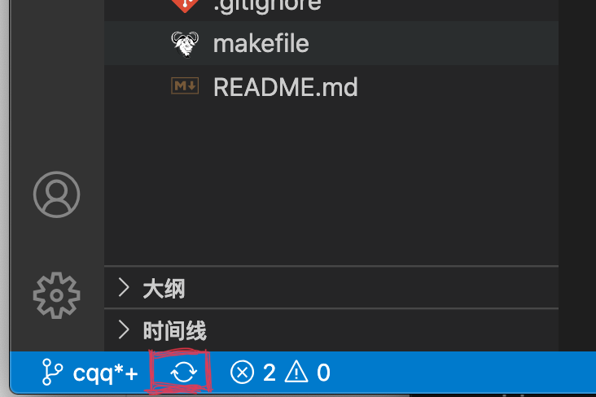
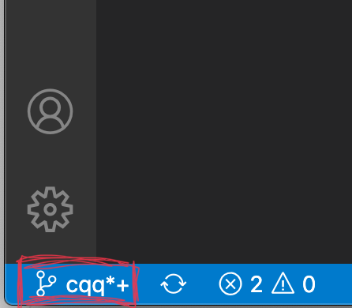
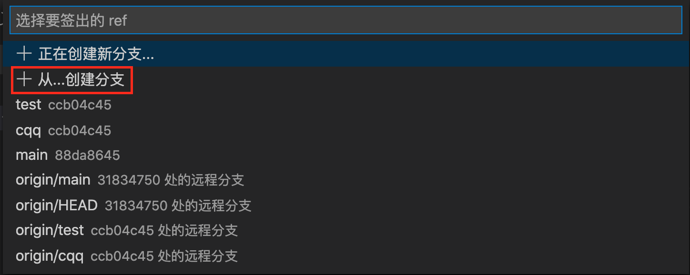
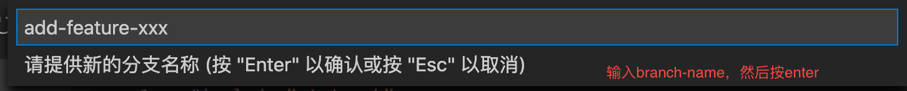
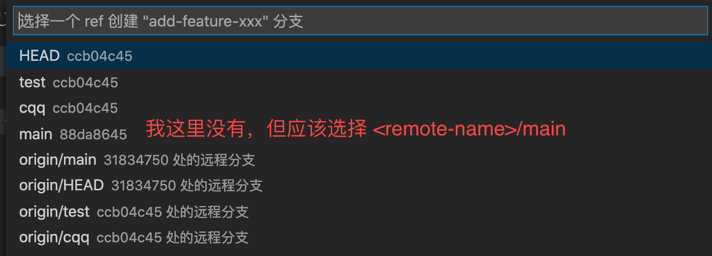
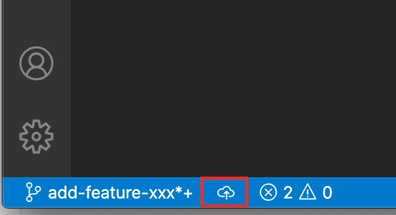
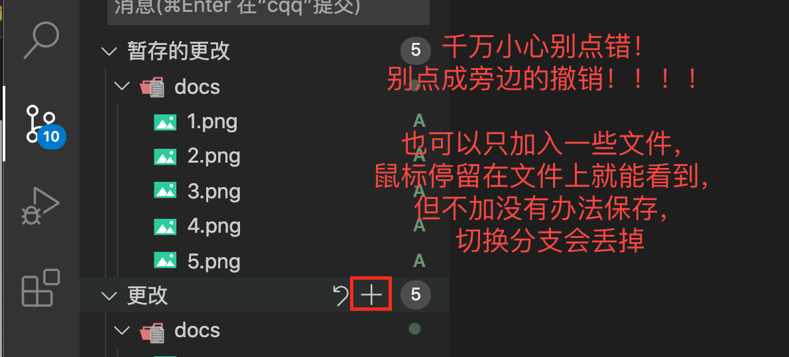
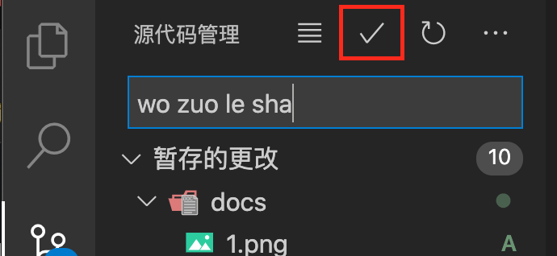

20201116 by chenqiqian

### How to code with others: Git & GitHub

distributed version control system

used widely in development

#### Questions in collaboration

Persistent version preservation?

Save size and time.

#### Conception 

- **git**: an open source, distributed version-control system
- **GitHub**: a platform for hosting and collaborating on Git **repositories**
- **commit** 提交: a Git object, a snapshot of your entire repository compressed into a SHA
- **branch** 分支: a lightweight movable pointer to a commit
- **clone** 克隆: a local version of a repository, including all commits and branches
- **remote** 远端: a common repository on GitHub that all team members use to exchange their changes
- **pull**: 拉取 Pull operation copies the changes from a remote repository instance to a local one. The pull operation is used for synchronization between two repository instances. This is same as the update operation in Subversion.
- **push**：推送 Push operation copies changes from a local repository instance to a remote one. This is used to store the changes permanently into the Git repository. This is same as the commit operation in Subversion.
- **HEAD**: representing your current working directory, the HEAD pointer can be moved to different branches, tags, or commits when using `git checkout`
- **fork** : a copy of a repository on GitHub owned by a different user
- **pull request** 拉取请求 : a place to compare and discuss the differences introduced on a branch with reviews, comments, integrated tests, and more

#### about macOS: homebrew

+ https://mirrors.tuna.tsinghua.edu.cn/help/homebrew/

#### usage: git and GitHub

###### First Time

https://www.liaoxuefeng.com/wiki/896043488029600/900375748016320

1. https://desktop.github.com/ GUI version of git and github
2. Sign up a account of github.com https://github.com/join
   + personal email preferred
3. ssh keys 
   + 【windows】https://www.jianshu.com/p/9317a927e844
   + 【macOS】https://blog.csdn.net/ShuTongIt/article/details/78902788
4. Fork & Clone
   + https://github.com/ChenQiqian/ERISC-Simulator `Fork` on the top right of the page
   + in terminal: `git clone git@github.com:<your-username>/ERISC-Simulator.git`
5. add upstream: 
   + `git remote add <remote-name> git@github.com:ChenQiqian/ERISC-Simulator.git` add a remote source to your repo
   + `git fetch <remote-name>`  
###### When you want to work

All commands: https://training.github.com/downloads/zh_CN/github-git-cheat-sheet/

NOTICE: anything unclear, ask me!

NOTICE: be sure where your work is, your computer or GitHub?

1. **Update your code's version** : 
+ get the newest version of `main` branch from my repo

| Command Line                             | VS Code                               |
| ---------------------------------------- | ------------------------------------- |
| `git fetch <remote-name>` or `git fetch` |  |

2. **Whatever you want to do, just add a branch** (add feature: feature-xxxx;fix bugs: fix-bug-xxxx ...)
+ create a branch, switch to it, from `<remote-name>/main`

| Command Line                                     | VS Code                                                      |
| ------------------------------------------------ | ------------------------------------------------------------ |
| `git switch -c <branch-name> <remote-name>/main` |     |

+ create a same-name branch on remote server

| Command Line                    | VS Code                               |
| ------------------------------- | ------------------------------------- |
| `git push origin <branch-name>` |  |

+ [special step for Command Lines] set default upstream

| Command Line                                   | VS Code |
| ---------------------------------------------- | ------- |
| `git push --set-upstream origin <branch-name>` | NO NEED |

Commands that you may need:

+ delete local branch（which would have no impact on your remote repo）

| Command Line                  | VS Code                      |
| ----------------------------- | ---------------------------- |
| `git branch -d <branch-name>` | not find, use github Desktop |

+ delete remote branch:

| Command Line                             | VS Code                      |
| ---------------------------------------- | ---------------------------- |
| `git push origin --delete <branch-name>` | not find, use github Desktop |

3. **Code with VSCode** https://code.visualstudio.com/Download 【Git Intergrated】

+ formatter: right click in the document
+ leave enough comments, make sure the code is bug-free
+ check the program: `make` [details to be done]

4. **Use Git to save your work**

+ Add your work to the save list:

| Command Line                                | VS Code                                |
| ------------------------------------------- | -------------------------------------- |
| `git add [file]` or `git add .` [all files] |  |

[put your mouse on buttons, it will tell you what it is used for!!!!]

+ Commit your work, leave a snapshot of a period of work

| Command Line                    | VS Code                                |
| ------------------------------- | -------------------------------------- |
| `git commit -m "wo zuo le sha"` |  |

+ push to GitHub

| Command Line | VS Code |
| ------------ | ------- |
| `git push`   |         |

3. 

5. After finishing the work: merging your part into main project: using **Pull Request**
   + https://github.com/username/ERISC-Simulator/compare/
   + remind me in WeChat, and I will check the code and merge it into the main branch
   + delete the branch in **your** repo if you want 

other references:
   1. update code from remote: https://zhuanlan.zhihu.com/p/89607964
   2. git remote https://blog.csdn.net/qq_25458977/article/details/87875641
   3. git branch http://www.ruanyifeng.com/blog/2012/07/git.html
   4. git merge/rebase https://www.jianshu.com/p/c17472d704a0

### How to compile multiple C++ files

https://blog.csdn.net/ruglcc/article/details/7814546